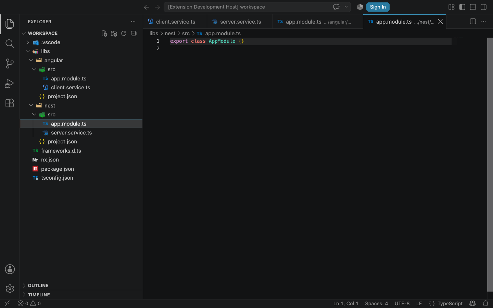

# VS Code Icons++


All vscode-icons file and folder icons, with Angular and Nest icons detected per project in Nx workspaces.

[Marketplace](https://marketplace.visualstudio.com/items?itemName=EthanSK.vscode-icons-plus-plus) · [Releases](https://github.com/EthanSK/vscode-icons-plus-plus/releases) · [Issues](https://github.com/EthanSK/vscode-icons-plus-plus/issues)



## Install

Install **VS Code Icons++** by **EthanSK** from the VS Code Extensions view, or run:

```sh
code --install-extension EthanSK.vscode-icons-plus-plus
```

Select **VS Code Icons++** under **Preferences: File Icon Theme**. If you use the original **vscode-icons**, install this extension first, then uninstall the original. Keep only one enabled.

The existing `vsicons.*` settings, custom file associations and custom icon folder continue to work. Commands and the theme have their own `vscode-icons-plus-plus` identity. Marketplace installs receive normal automatic updates; there is no need to sideload each release.

## Angular and Nest in one workspace

Nx projects are detected from `project.json`, Nx package manifests and legacy workspace project entries. Each project's imports and configuration determine its framework, so Angular services and Nest services can appear together. File moves and configuration changes update the icons automatically.

VS Code can match a filename and its immediate parent folder, but cannot distinguish full project paths. If Angular and Nest both contain `src/app.module.ts`, those conflicting files use neutral TypeScript icons. Unknown and mixed projects also stay neutral. Separate VS Code windows still share a generated theme. The browser extension uses the ordinary static icon set.

[Detection and limitations](docs/nx-project-icons.md) · [Verification](docs/nx-verification.md)

## Build and test

Use Node.js 22.13 or later for development.

```sh
npm ci
npm test
npm run lint
npm run package:vsix
```

The package command builds production bundles and creates `vscode-icons-plus-plus-1.0.0.vsix`. The build updates generated entrypoint paths in `package.json`; restore those paths before running unit tests again. [Release procedure](docs/releasing.md) explains packaging, native verification and publication.

## Origin and license

Fork of [vscode-icons](https://github.com/vscode-icons/vscode-icons), maintained here by [Ethan SK](https://github.com/EthanSK). The original icon artwork, supported associations and translations come from its contributors. This fork is independently published and is not an official VSCode Icons Team release.

The original [MIT license](LICENSE) and icon-specific notices are preserved. See the upstream [customization guide](https://github.com/vscode-icons/vscode-icons/wiki/Customization) and [custom icons guide](https://github.com/vscode-icons/vscode-icons/wiki/Custom) for the compatible `vsicons.*` settings.
