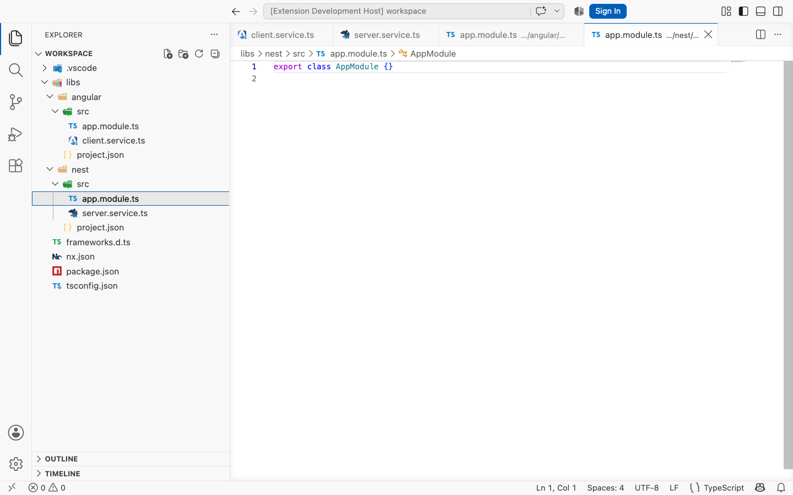

# VS Code Icons++ 1.0.0 verification

Verified on 20 September 2026.

- 724 automated tests passed (`npm test`), including a 21,000-source-file scan, cached repeat scans, disable/re-enable and conservative refusal of a truncated workspace.
- ESLint, formatting, production build and VSIX packaging passed.
- The exact packaged extension passed the native test in VS Code 1.132.0 on a Mac mini with an isolated profile and synthetic Nx workspace.
- The VSIX manifest was checked for the `EthanSK.vscode-icons-plus-plus` identity, version `1.0.0`, display name **VS Code Icons++**, separate theme/commands, production entrypoint, icon artwork and absence of a settings-deleting uninstall hook.
- VSIX SHA-256: `17004226d13392b29c18718c0536b90ebc9d294519aa0d0c34b72e56e755ac75`.
- Production JavaScript SHA-256: `4b18b1a6f787b41851b91196eb4631d0731e5f82694c55a11855cf6951653b2a`.

The native test verified simultaneous Angular and Nest icons in the real Explorer, two neutral colliding module files, dark/light themes, source-file creation/moves/deletion, project framework changes, disabling/re-enabling detection, and explicit custom icon precedence/removal. The packaged display name and theme label were also asserted. Screenshots were inspected after the checks. The test closes its own VS Code process and does not use the normal user profile.

A separate read-only scan of 21 local workspace folders containing 44,027 source/config files found 1,407 projects. On that machine, the initial filesystem scan took 4.4 seconds, a cached repeat took 0.19 seconds, and the audit process used approximately 51 MB of JavaScript heap. These measurements are an audit of the scanner, not a guarantee for other machines or the complete VS Code process. Cached source files retain framework evidence instead of full document contents.

## Dark theme

## Light theme

This verifies mixed projects within one workspace; independently opened VS Code windows still share a generated theme. See [detection and API limitations](nx-project-icons.md). Publication requires the separate [Marketplace release gate](releasing.md).
